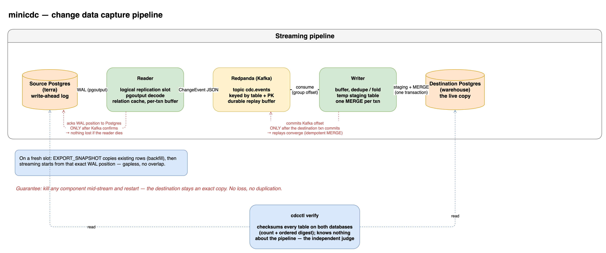

# minicdc

A small change data capture engine: it watches a Postgres database's write-ahead log and keeps a live copy of its tables in a second database, without losing or duplicating a change. One source, one destination, built from first principles as a study of how systems like [Artie](https://artie.com) work.

```text
source Postgres ──WAL──▶ reader ──▶ Redpanda ──▶ writer ──▶ destination Postgres
```

The source fixture is Artie's own [terra](https://github.com/artie-labs/terra) demo dataset, run unmodified.

## Architecture



The reader acks a WAL position to Postgres only after Kafka confirms; the writer commits a Kafka offset only after the destination transaction commits. Those two rules are what make a kill of any component survivable. Diagram source (editable): [docs/assets/architecture.drawio](docs/assets/architecture.drawio).

## Run it

Everything below runs from the repo root and needs only Docker and Go.

```bash
./deploy/fetch-terra.sh                             # one-time: clone the terra source fixture
docker compose -f deploy/docker-compose.yml up -d   # source pg + redpanda + dest pg
go build ./...                                      # build the binaries into bin/
./bin/reader &                                       # WAL -> Kafka
./bin/writer &                                       # Kafka -> destination
```

Insert a row on the source:

```bash
docker exec minicdc-source psql -U postgres -d terra -c "INSERT INTO animals (animal_id, name, species, home_watering_hole_id, status) VALUES (9999, 'Testo', 'lion', 1, 'adult');"
```

See it arrive in the destination a second later:

```bash
docker exec minicdc-dest psql -U postgres -d warehouse -c "SELECT animal_id, name, __minicdc_commit_ts, __minicdc_updated_at FROM public.animals WHERE animal_id = 9999;"
```

## Demo

Narrated scripts, each prints what it runs and why. Run setup once, then the beats in any order:

```bash
./scripts/demo-setup.sh       # clean, seeded source; destination backfilled; pipeline live
./scripts/demo-replicate.sh   # a row through insert/update/delete, then bulk ops under a live stream
./scripts/demo-crash.sh       # kill the writer mid-stream, restart, prove the copy is still exact
./scripts/demo-latency.sh     # sustained load, then report streaming latency
```

Optional, to see the data itself and the CDC-vs-batch comparison:

```bash
./scripts/open-db-gui.sh      # open both databases in TablePlus (source + destination), preconfigured
./scripts/bench-vs-batch.sh   # streaming CDC vs batch snapshot copy, across table sizes
```

`demo-replicate.sh` shows the source and destination tables after each change so you watch the row appear, change, and vanish on both sides; the others print source-vs-destination counts at the moments that matter and finish with `VERIFY: all 3 tables MATCH`. All are safe to re-run without re-running setup. `open-db-gui.sh` needs TablePlus (`brew install --cask tableplus`).

## Guarantees

- **No loss, no duplication under crashes.** The reader acks a WAL position to Postgres only after Kafka confirms the events; the writer commits a Kafka offset only after the destination transaction commits. A `kill -9` of either side re-delivers a batch, and the writer's merge re-asserts the same final state, so replays are harmless. Proven, not asserted: `scripts/crash-test.sh` kills both processes mid-load and requires `cdcctl verify` to report an exact match.
- **Backfill to live, gapless.** A fresh pipeline copies existing rows from a snapshot exported at slot creation, then streams from that exact WAL position. `scripts/backfill-test.sh` seeds the source, writes concurrently during backfill, and verifies.
- **Correct on the hard cases.** Unchanged TOAST columns are preserved rather than nulled; primary-key-changing updates become delete+insert; multi-row transactions stay ordered per row via table+PK Kafka keys.

## Why streaming: CDC vs batch snapshots

Latency is measured the way Artie's benchmarks repo does: stamp the source commit time on every row, diff it against the destination apply time. But a latency number needs a baseline to mean anything. The honest baseline is the pre-CDC alternative: periodically re-copy the table (batch snapshots). A snapshot's freshness floor is how long one full copy takes, and that grows with the table, while streaming CDC only ever touches the change:

| rows | batch snapshot copy | streaming CDC (ours) |
| ---: | --- | --- |
| 10K | 0.20s | 1.1s |
| 100K | 0.55s | 1.1s |
| 1M | 2.51s | 1.1s |
| 10M | 44.2s | 1.1s |

At small scale the snapshot wins: our 1.1s is just the flush interval, and copying 10K rows is trivial. The lines cross near 1M, and past it batch copy climbs linearly (extrapolating, ~5 min at 100M) while CDC stays flat. That gap is the entire reason log-based CDC exists, and it is why nobody keeps a large production database fresh by re-copying it.

Laptop numbers (a colima VM, single Redpanda broker, Postgres to Postgres); the shape matters, not the absolute values. CDC latency here is set by the writer's 2s flush interval, a deliberate latency-versus-merge-cost knob (Artie's "multi-step merge" tradeoff), not a ceiling. Reproduce with `scripts/bench-vs-batch.sh`.

## Commands

Three demo scripts, each self-contained (they reset the stack, so run one at a time):

```bash
./scripts/crash-test.sh 60      # load, kill -9 writer and reader mid-stream, restart, verify MATCH
./scripts/backfill-test.sh 80   # seed 1430 rows, replicate them while writing live, verify
./scripts/bench.sh 400          # sustained load, then report end-to-end latency + write a CSV
```

The system those scripts drive:

| Command | What it does |
| --- | --- |
| `go build ./...` | build the three binaries into `bin/` |
| `./bin/reader` | source side: read the WAL, publish change events to Kafka (runs until killed) |
| `./bin/writer` | destination side: consume events, apply via staging + merge (runs until killed) |
| `./bin/cdcctl verify [--timeout 30s]` | checksum every table on both databases, print MATCH or MISMATCH; the independent judge |
| `./bin/cdcctl latency [--table T] [--csv PATH]` | report avg/p95/max end-to-end latency from the destination's timestamp columns |

Setup and stack control:

| Command | What it does |
| --- | --- |
| `./deploy/fetch-terra.sh` | one-time: clone the terra source fixture |
| `./scripts/reset.sh` | destroy volumes and bring the stack back up freshly seeded (clean slate) |
| `./scripts/load.sh [N]` | generate N iterations of mixed insert/update/delete traffic (the workload the demos use) |
| `docker exec -it minicdc-source psql -U postgres -d terra` | open a shell on the source database |
| `docker exec -it minicdc-dest psql -U postgres -d warehouse` | open a shell on the destination database |

The scripts are three complete demos; the binaries are the system they drive (run them by hand only for the manual walkthrough above); `cdcctl` inspects results; `reset.sh` gets you back to zero.

## How it's built

Five phases, each with a function trace and the data shapes flowing through it, in [docs/](docs/): the flowing skeleton, correctness via staging merge, recovery, backfill, and schema evolution plus benchmarking. The design keeps the writer ignorant of the source: every change (insert, update, delete, and snapshot read) is the same self-describing JSON event, so backfill and streaming share one apply path.
